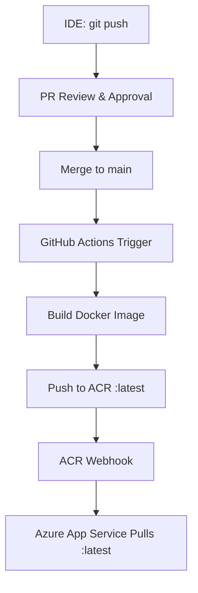
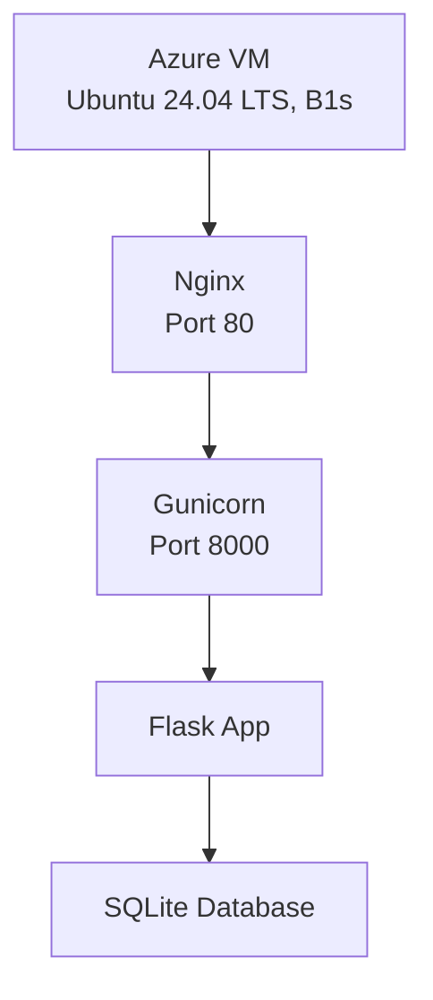

<h1 align="center">Project Overview</h1>

## Logical Architecture

<h3 align="center"><u>CI/CD Pipeline</u></h3>

---

<h2 align="center">🏗️ Architecture</h2>

| Component | Description |
|-----------|-------------|
| **Azure VM** | Cloud infrastructure running Ubuntu 24.04 LTS on B1s tier |
| **Nginx** | Reverse proxy handling incoming HTTP traffic on port 80 |
| **Gunicorn** | WSGI server with 4 workers processing requests on port 8000 |
| **Flask App** | Python web application handling routes and business logic |
| **SQLite** | Lightweight database storing job posting data |

---

<h2 align="center">📦 Tech Stack</h2>

| Component | Technology |
|-----------|------------|
| **Framework** | Flask 3.0.0 |
| **Server** | Gunicorn 21.2.0 (4 workers) |
| **Reverse Proxy** | Nginx |
| **Database** | SQLite |
| **Python** | 3.11+ |
| **OS** | Ubuntu 24.04 LTS |

