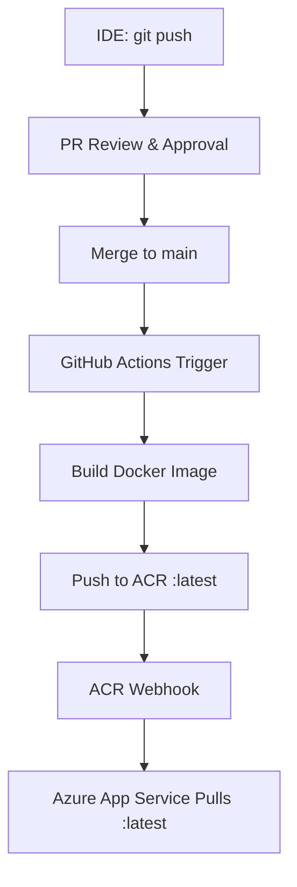

# Project Overview

## Key Features

- **Health Check**: Support for Azure Load Balancer health probes
- **Production Ready**: Uses Gunicorn + Supervisor + Nginx

### CI/CD Pipeline



---

## 🏗️ Architecture

```
Azure VM (Ubuntu 24.04 LTS, B1s)
           ↓
Nginx (Port 80) → Reverse Proxy
           ↓
Gunicorn (Port 8000) → Flask App
           ↓
   SQLite Database (Demo Data)
```

---

## 📦 Tech Stack

| Component | Technology |
|-----------|------------|
| **Framework** | Flask 3.0.0 |
| **Server** | Gunicorn 21.2.0 (4 workers) |
| **Reverse Proxy** | Nginx |
| **Database** | SQLite |
| **Python** | 3.11+ |
| **OS** | Ubuntu 24.04 LTS |
