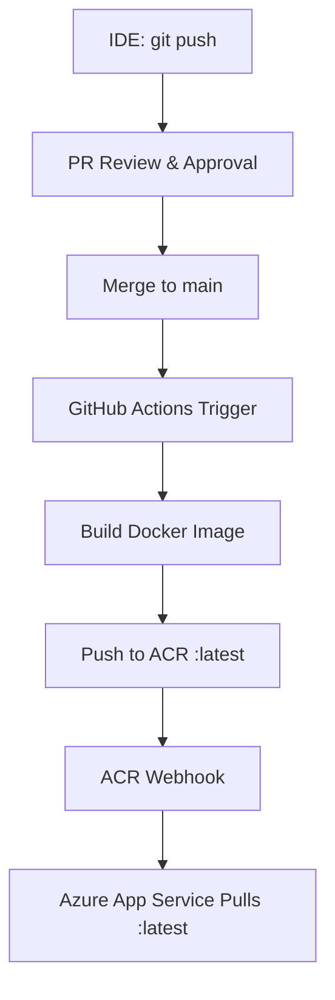

<h1 align="center">Project Overview</h1>

<h3 align="center"><u>CI/CD Pipeline</u></h3>

<p align="center">



</p>

---

<h2 align="center">🏗️ Architecture</h2>

```
Azure VM (Ubuntu 24.04 LTS, B1s)
           ↓
Nginx (Port 80) → Reverse Proxy
           ↓
Gunicorn (Port 8000) → Flask App
           ↓
   SQLite Database (Demo Data)
```

---

<h2 align="center">📦 Tech Stack</h2>

| Component | Technology |
|-----------|------------|
| **Framework** | Flask 3.0.0 |
| **Server** | Gunicorn 21.2.0 (4 workers) |
| **Reverse Proxy** | Nginx |
| **Database** | SQLite |
| **Python** | 3.11+ |
| **OS** | Ubuntu 24.04 LTS |
